# 钢琴

如何弹奏钢琴。

### 一、五线谱

#### 1. 调

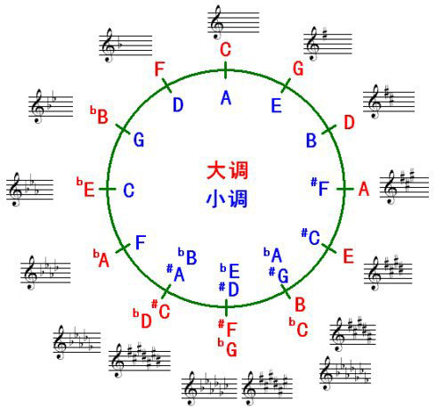

### 二、12大调音阶与键盘音名、简谱的对照表

#### 1. 大调

C大调音阶: C D E F G A B C
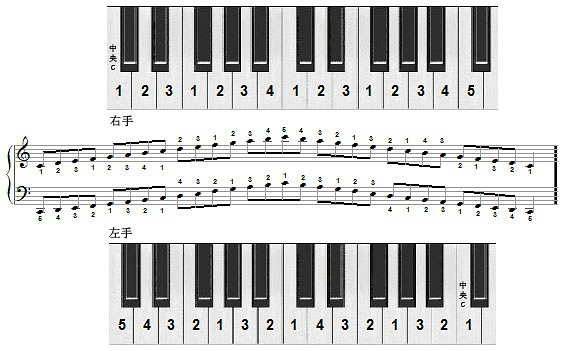

G大调音阶: G A B C D E F# G
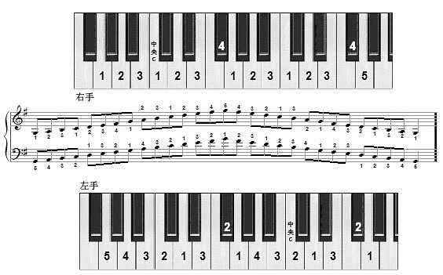

D大调音阶: D E F# G A B C# D

A大调音阶: A B C# D E F# G# A
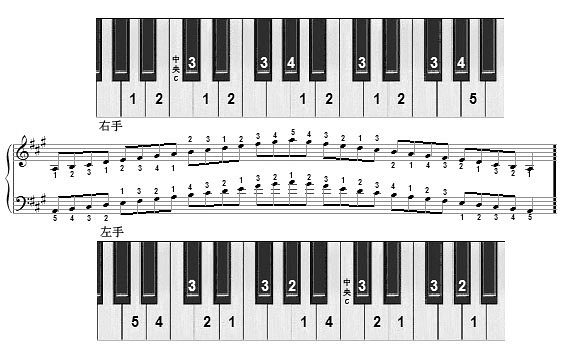

E大调音阶: E F# G# A B C# D# E
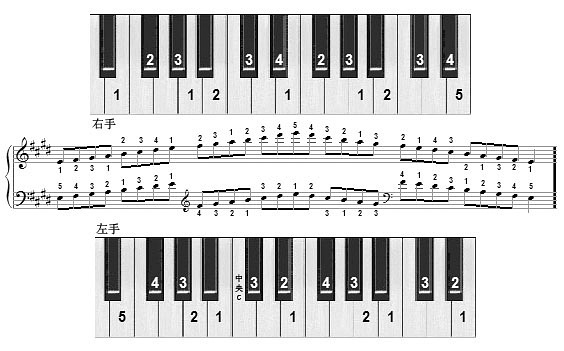

B大调音阶: B C# D# E F# G# A# B
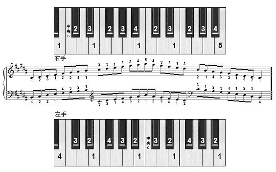

F#大调音阶: F# G# A# B C# D# E# F#
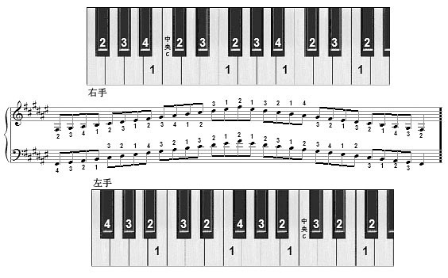

Db大调音阶: Db Eb F Gb Ab Bb C Db
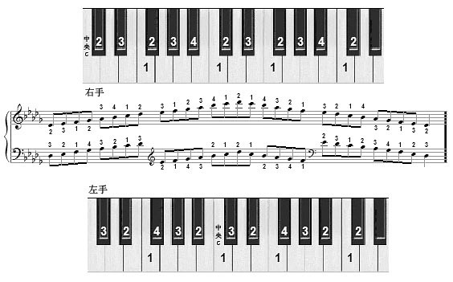

Ab大调音阶: Ab Bb C Db Eb F G Ab
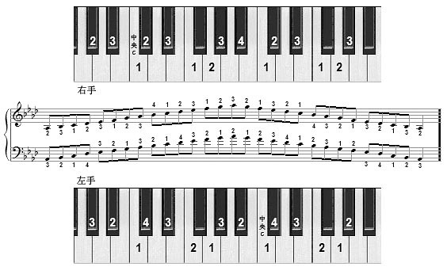

Eb大调音阶: Eb F G Ab Bb C D Eb
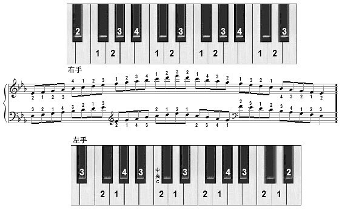

Bb大调音阶: Bb C D Eb F G A Bb
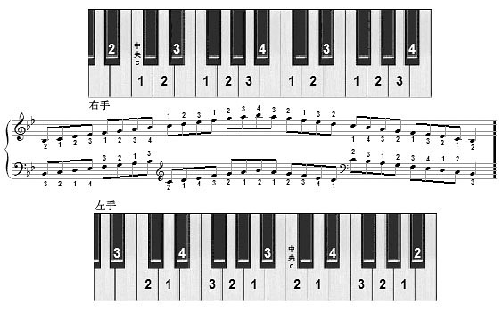

F大调音阶: F G A Bb C D E F
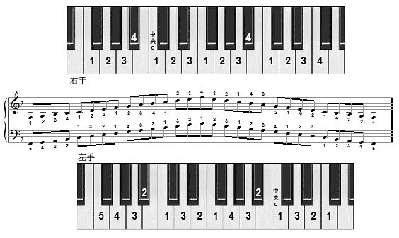

#### 2. 小调