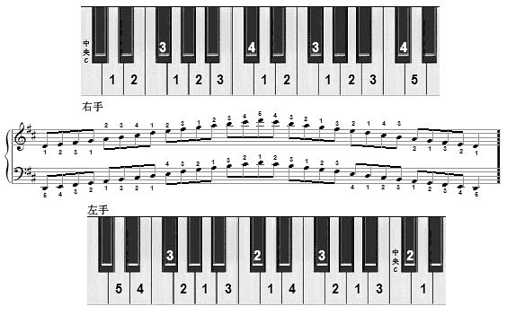

# 钢琴

如何弹奏钢琴。

### 一、五线谱

#### 1. 调
我们平常说的大调是指西洋音乐中的大小调，共有24个，分别是: 

无升降号：C大调，a小调

一个升号：G大调，e小调
两个升号：D大调，b小调
三个升号：A大调，f♯小调
四个升号：E大调，c♯小调
五个升号：B大调，g♯小调
六个升号：F♯大调，d♯小调
七个升号：C♯大调，a♯小调

一个降号：F大调，d小调
两个降号：B♭大调，g小调
三个降号：E♭大调，c小调
四个降号：A♭大调，f小调
五个降号：D♭大调，b♭小调
六个降号：G♭大调，e♭小调
七个降号：C♭大调，a♭小调

​		这样一来一共得出30个调了。其中`七个降号`的调与`五个升号`的调重复，抵消掉两个，`六个降号`的调与`六个升号`的调重复，抵消掉两个，`五个降号`的调又与`七个升号`的调重复，又抵消两个，共抵消掉6个调，因此一共24个大小调。

### 二、12大调音阶与键盘音名、简谱的对照表

#### 1. 大调

C大调音阶: C D E F G A B C

G大调音阶: G A B C D E F♯ G

D大调音阶: D E F♯ G A B C♯ D

A大调音阶: A B C♯ D E F♯ G♯ A

E大调音阶: E F♯ G♯ A B C♯ D♯ E

B大调音阶: B C♯ D♯ E F♯ G♯ A♯ B

F♯大调音阶: F♯ G♯ A♯ B C♯ D♯ E♯ F♯

D♭大调音阶: D♭ E♭ F G♭ A♭ B♭ C D♭

A♭大调音阶: A♭ B♭ C D♭ E♭ F G A♭

E♭大调音阶: E♭ F G A♭ B♭ C D E♭

B♭大调音阶: B♭ C D E♭ F G A B♭

F大调音阶: F G A B♭ C D E F

#### 2. 小调

c小调音阶: 1 2 3♭ 4 5 6♭ 7♭ 1

g小调音阶: 5 6 7♭ 1 2 3♭ 4 5

d小调音阶: 2 3 4 5 6 7♭ 1 2

a小调音阶: 6 7 1 2 3 4 5 6

e小调音阶: 3 4♯ 5 6 7 1 2 3

b小调音阶: 7 1♯ 2 3 4♯ 5 6

f小调音阶: 4 5 6♭ 7♭ 1 2♭ 3♭ 4

f♯小调音阶: 4♯ 5♯ 6 7 1♯ 2 3 4♯

c♯小调音阶: 1♯ 2♯ 3 4♯ 5♯ 6 7 1♯

g♯小调音阶: 5♯ 6♯ 7 1♯ 2♯ 3 4♯ 5♯

b♭小调音阶: 7♭ 1 2♭ 3♭ 4 5♭ 6♭ 7♭

e♭小调音阶: 3♭ 4 5 6♭ 7♭ 1♭ 2♭ 3♭

